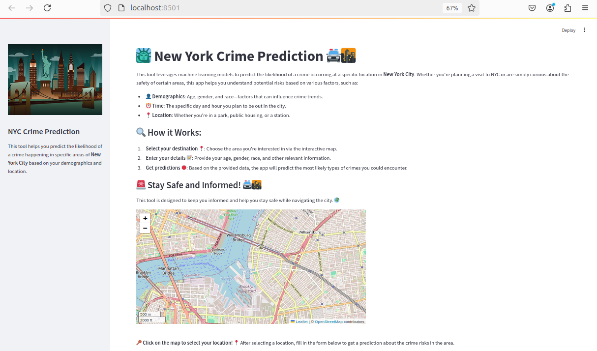
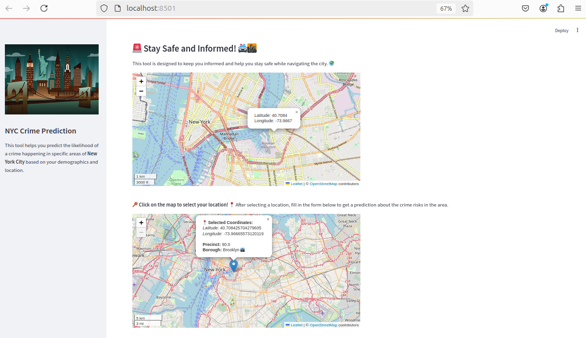

# 🗽 **New York City Crimes Detection Using Machine Learning**

<div align="center">
  <h4>
    <a href="#overview">📋 Overview</a> |
    <a href="#dataset">📊 Dataset</a> |
    <a href="#notebooks">💻 Notebooks</a> |
    <a href="#technologies">🛠️ Technologies</a> |
    <a href="#install-dependencies">🚀 Install Dependencies</a> |
    <a href="#how-to-run">🚀 How to Run</a> |
    <a href="#user-interface">🖥️ User Interface</a> |
    <a href="#paper">📄 Paper</a> |
    <a href="#credits">🙌 Credits</a>
  </h4>
</div>

---

## 📋 **Overview**

Predicting crime probabilities is crucial for enhancing public safety. This machine learning-based web application utilizes historical crime data from New York City to provide valuable insights into potential crime occurrences. By integrating user-specific details such as location and time, the application empowers users to make informed decisions and take preventive actions. Whether planning a route, selecting a residential area, or staying aware of potential risks, this tool offers a proactive approach to personal safety.

---

## 📊 **Dataset**

We utilize the **[NYPD Complaint Data Historic Dataset](https://data.cityofnewyork.us/)**, which includes comprehensive details about reported crimes in NYC.

### Key Features:

- **6,901,167 complaints** (from 2006 to 2021)
- **35 attributes**, including:
  - Temporal data (date, time)
  - Spatial data (latitude, longitude)
  - Crime descriptions (type, classification)

---

## 💻 **Notebooks**

### 📂 Repository Includes:

- 🧹 [**Data Cleaning & Exploratory Data Analysis (EDA)**](research/EDA.ipynb)  
  Perform initial data cleaning and explore key patterns in the dataset.

- 🤖 [**Data Preparation & Modeling**](research/Modeling.ipynb)  
  Train and evaluate machine learning models for crime prediction.

---

## 🛠️ **Technologies**

### 🌐 **Web Application**

- **Streamlit**: Dashboard development
- **Folium**: Interactive maps
- **geopy**: Geocoding
- **geopandas**: Spatial data manipulation
- **shapely**: Geometric operations
- **Docker**: Containerization

### 📈 **Data Processing**

- **Pandas**: Data manipulation
- **Seaborn** & **Matplotlib**: Visualization
- **Scikit-learn**: Machine learning framework
- **LightGBM**, **XGBoost**, **CatBoost**: Advanced boosting algorithms

---

## 🚀 **Install Dependencies**

### Step 1: Create a Virtual Environment

```bash
python -m venv venv
source venv/bin/activate # On macOS/Linux
venv\Scripts\activate    # On Windows
```

### Step 2: Install Required Libraries

```bash
cd app
pip install -r requirements.txt
```

---

## 🚀 **How to Run**

### Step 1: Clone the Repository

```bash
git clone https://github.com/your-repo/nyc-crime-detection.git
cd NYC_Crime_Prediction
```

### Step 2: Start the Application

```bash
cd app
streamlit run main.py
```

### Step 3: Access the Application

Open your browser at:

```
http://localhost:8501
```

---

## 🖥️ **User Interface**

### 📍 **Interactive Dashboard**

An overview of the main application layout and features:



---

### 📈 **Map Selection & Predictions**

Select your location on an interactive map and receive crime predictions:



---

### 📝 **Form & Detailed Results**

Fill in your details and view crime probabilities with detailed insights:


---

## 📄 **Paper**

Explore our detailed research findings in the accompanying [paper](docs/NYC_Paper.pdf).

---

## 🙌 **Credits**

This project was developed by:

- **Nour Mabrouk**
- **Bacem Ahmed**
- **Anas Ben Amor**
